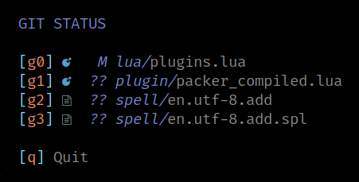

# `alpha_startify_gst`

Monkey patched [alpha-nvim's startify theme](https://github.com/goolord/alpha-nvim/blob/main/lua/alpha/themes/startify.lua) to add a section for files listed
in `git status` output.

**Current status:** MVP/Quick hack



## Usage

Setup alpha-nvim with the config from this module.

With [Packer](https://github.com/wbthomason/packer.nvim):

```lua
use {
  'goolord/alpha-nvim',
  config = function()
    require('alpha').setup(require('alpha_startify_gst').config)
  end,
  requires = 'walterl/alpha_startify_gst'
}
```

## License

[MIT](./LICENSE.md)
